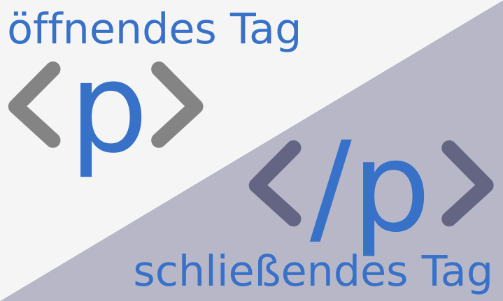

+++
title = "HTML - Hypertext Markup Language"
date = "2022-10-18"
draft = false
pinned = false
image = "html_blog-scaled.jpeg"
footnotes = "Geschrieben von Erdi Qosi WM20B"
+++
**HTML**,\
ist einer der **wichtigsten Programmiersprachen** der Welt. Diese Programmiersprache wird dazu verwendet, um **Webseiten herzustellen** und damit haben wir heute begonnen. Heute haben wir zum ersten Mal mit **Visual Studio Code** gearbeitet. Wir haben das Codieren gelernt, einfacher gesagt haben wir mit HTML-Tags gearbeitet. 

Als aller Erstes hat unsere Lehrperson uns gezeigt, wie man die **Einstellungen** machen soll. Das Ziel dieser Lektion war es, eine **einfache Webseite** zu erstellen. Wir haben am Anfang so Codes wie "**p"** oder "**title"** kennengelernt. Es ist wichtig, dass man HTML-Tags öffnet und dann wieder schliesst. Jedoch ist es nicht bei jedem Tag so. 

**Alles kurz zusammengefasst:**\
In dieser Lektion wurde uns das **arbeiten** mit **HTML-Tags** beigebracht. Wir haben das mit dem Programm **Visual Studio Code** gemacht. Uns wurde beigebracht, dass man einen Tag **öffnen** und **schliessen** muss. Durch mein Vorwissen hat diese Lektion spass gemacht und war lehrreich.

**Selbstreflektion:**\
Das einfache Programmieren hat mir sehr gefallen und ich bin sehr daran interessiert. Durch das Lernen vom Programmieren können wir danach für unser Projekt ganz einfache eine Webseite machen. Wir können in unserer Webseite Links und Bilder einfügen und so unsere Seite attraktiver gestalteten. Da ich mich auch vorher schon für das programmieren interessiert habe, finde ich es umso besser, dass wir dieses Thema im WEB anschauen. Ich freue mich schon auf das arbeiten mit CSS und bin gespannt, wie es weiter geht.