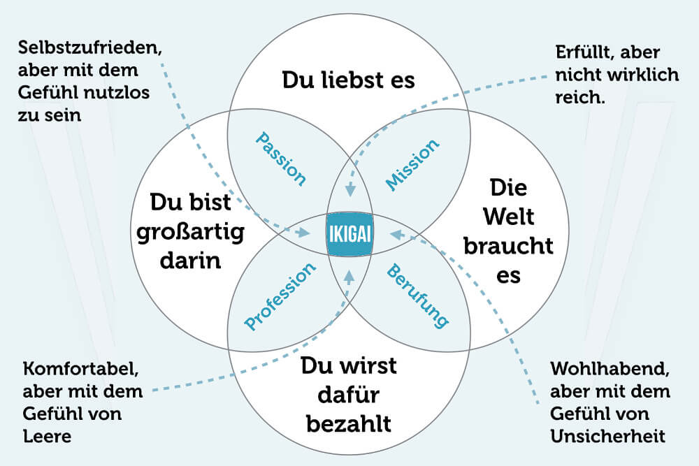

+++
title = "IKIGAI"
date = "2022-09-13"
draft = false
pinned = false
image = "ikigai.jpg"
footnotes = "Geschrieben von Erdi Qosi WM20B"
+++
**IKIGAI-TEST**\
Heute haben wir einen **Ikigai Test** absolviert. In diesem Test musste man **verschiedene Fragen** beantworten und bekam dann eine **Lösung**. Durch diesen Test hatte man sich vielleicht **besser kennengelernt** und man bekam kleine **Kommentare** zu diversen Bereichen. Danach hatten wir auch einen **Stand Up Meeting** und einen Input zu **Lean Start Up's**.

**Was hat nicht geklappt und unsere nächste Schritte:**\
Im Grossen und Ganzen hat alles **gut** geklappt. Wie der **Ikigai-Test** sowie auch das **Meeting**. Unser nächster Schritt ist es, diverse **Social Media Kanäle** zu eröffnen und eine **Webseite** für unser **Projekt** zu eröffnen, damit wir so **Kundschaft** anregen können.

