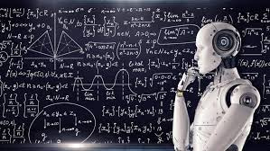

+++
title = "Künstliche Intelligenz: Die neue Ära der Technologie"
date = "2023-05-30"
draft = false
pinned = false
image = "istock-1034901762_peshkova.webp"
footnotes = "Geschrieben von GPT"
+++
Einleitung: In den letzten Jahrzehnten hat sich die Technologie in einem atemberaubenden Tempo weiterentwickelt. Eine der spannendsten und vielversprechendsten Innovationen ist zweifellos die Künstliche Intelligenz (KI). KI hat das Potenzial, die Art und Weise, wie wir leben, arbeiten und interagieren, grundlegend zu verändern. In diesem Blogbeitrag werfen wir einen Blick auf die aufregende Welt der Künstlichen Intelligenz und erkunden, wie sie unser Leben beeinflusst.

Was ist Künstliche Intelligenz? Künstliche Intelligenz bezieht sich auf Maschinen oder Computerprogramme, die in der Lage sind, Aufgaben auszuführen, die normalerweise menschliche Intelligenz erfordern. Diese Systeme können Daten analysieren, Muster erkennen, Schlussfolgerungen ziehen und sogar lernen, um ihre Leistung im Laufe der Zeit zu verbessern. KI kann in verschiedenen Bereichen eingesetzt werden, darunter Gesundheitswesen, Finanzen, Transport, Kommunikation und Unterhaltung.

Anwendungen von Künstlicher Intelligenz:

1. Gesundheitswesen: KI hat das Potenzial, die medizinische Diagnose und Behandlung zu revolutionieren. Durch den Einsatz von Algorithmen und maschinellem Lernen können Ärzte und Forscher Krankheiten schneller und genauer erkennen. KI kann auch bei der Entwicklung personalisierter Medikamente und der Analyse von medizinischen Bildern unterstützen.
2. Automobilindustrie: Selbstfahrende Autos sind ein herausragendes Beispiel für die Anwendung von KI. Diese Fahrzeuge nutzen fortschrittliche Sensoren und Algorithmen, um Verkehrssituationen zu erkennen und entsprechend zu reagieren. KI-basierte Assistenzsysteme können auch die Sicherheit und den Komfort für die Fahrer verbessern.
3. Kundenbetreuung: Viele Unternehmen setzen KI ein, um ihren Kundenservice zu verbessern. Chatbots und virtuelle Assistenten können Kundenanfragen schnell und effizient bearbeiten, rund um die Uhr verfügbar sein und gleichzeitig menschenähnliche Interaktionen bieten. Dies spart Zeit und Ressourcen für Unternehmen und ermöglicht eine nahtlose Kommunikation mit den Kunden.

Ethik und Herausforderungen: Bei aller Begeisterung für die Möglichkeiten von Künstlicher Intelligenz ist es wichtig, die damit verbundenen ethischen Fragen zu berücksichtigen. Datenschutz, Sicherheit und Transparenz sind entscheidende Aspekte, die berücksichtigt werden müssen, um sicherzustellen, dass KI-Systeme fair und verantwortungsvoll eingesetzt werden. Darüber hinaus ist die Sorge um den möglichen Verlust von Arbeitsplätzen durch Automatisierung eine wichtige Herausforderung, die angegangen werden muss.

Die Zukunft von Künstlicher Intelligenz: Die Entwicklung von Künstlicher Intelligenz wird mit Sicherheit weiter voranschreiten. Neue Technologien wie Deep Learning und neuronale Netze werden die Leistungsfähigkeit von KI-Systemen weiter verbessern. Es besteht auch die Möglichkeit, dass KI in der Lage sein wird, menschenähnliches Bewusstsein und kreatives Denken zu entwickeln. Dies wirft jedoch auch Fragen nach der Kontrolle und dem Potenzial von KI auf.

Fazit: Die Künstliche Intelligenz hat das Potenzial, unsere Welt grundlegend zu verändern. Ihre Anwendungen sind vielfältig und reichen von der Gesundheitsversorgung bis hin zur Kundenbetreuung. Es ist jedoch entscheidend, dass wir die ethischen und sozialen Implikationen von KI sorgfältig betrachten und sicherstellen, dass sie zum Wohl der Gesellschaft eingesetzt wird. Die Zukunft der Künstlichen Intelligenz ist vielversprechend, und wir stehen erst am Anfang einer aufregenden Ära der Technologie.